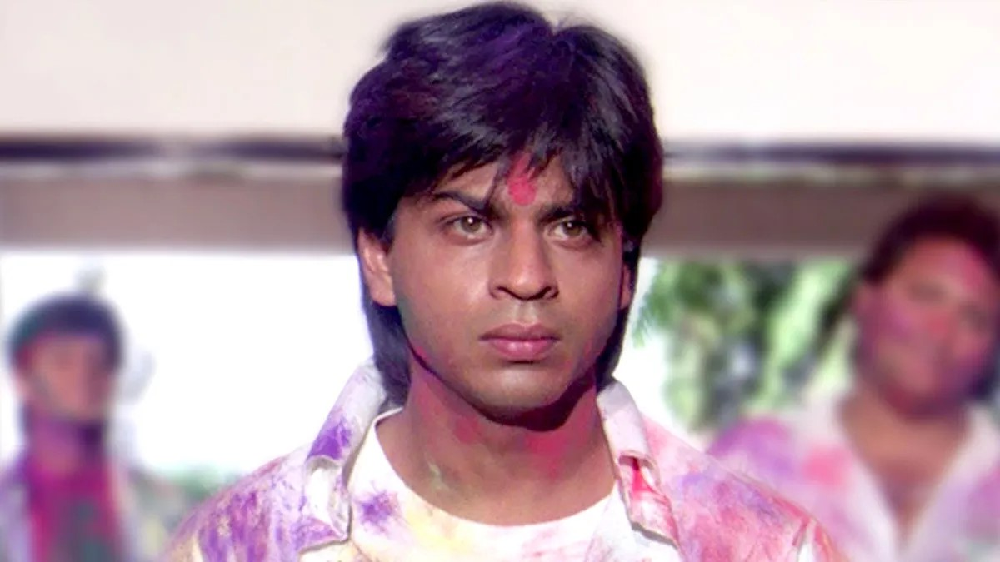
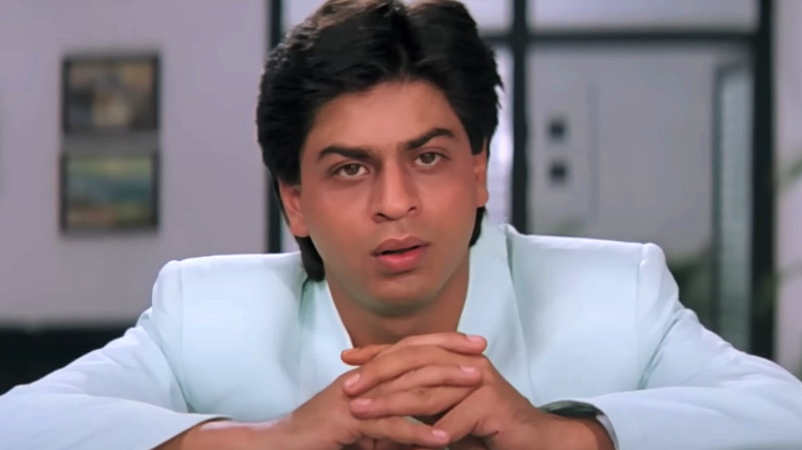
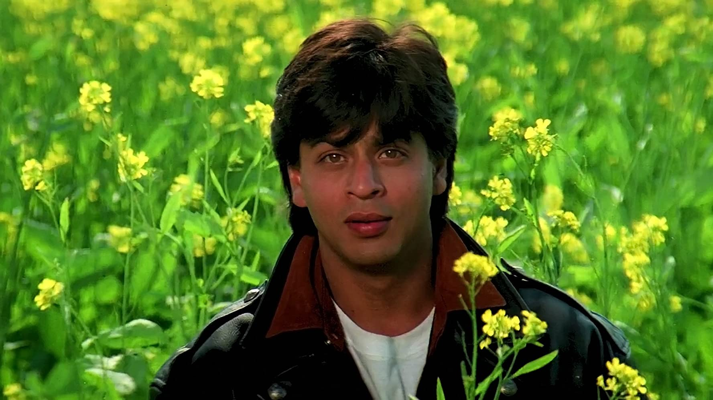
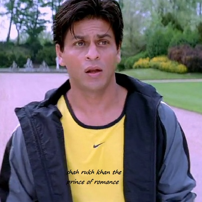

# AI-Powered Time-lapse Generation

This project uses deep learning to create smooth time-lapse videos from a sequence of images by interpolating intermediate frames. It leverages the Film-Style frame interpolation model to generate natural transitions between input frames.

Refer:
https://github.com/google-research/frame-interpolation/tree/main

## Features

- Frame interpolation between pairs of images using a pretrained neural network
- Support for multiple input image formats (PNG, JPEG, BMP)
- Automatic image resizing while maintaining aspect ratio
- Face timelapse with automatic face centering and background removal
- Configurable output FPS and interpolation settings
- GPU acceleration support

## Setup

### On Google colab
1. Open `time_lapse_Google_Colab.ipynb` notebook directly in colab.
2. Select runtime as T4 GPU from Settings.
3. Run the notebook:
Change the input and output paths and other settings
4. Notebook will automatically download the github repository, install requirements and download models.

### On Local
1. Create a conda environment with TensorFlow and GPU support. If you are on Windows, use WSL.

2. Install the required dependencies:
    ```bash
    pip install -r requirements.txt
    ```

3. Run the notebooks:
Select and input and output paths

## Usage

### Simple Frame Interpolation

Use the `simple_interpolation.ipynb` notebook to interpolate frames between two images:
```python
from eval import interpolator, util

# Initialize the interpolator
predictor = Predictor()
predictor.setup()

# Generate intermediate frames
output_frames = predictor.predict(
    frame1="input_frames/image1.jpg",
    frame2="input_frames/image2.jpg", 
    times_to_interpolate=5,
    out_dir="output_frames",
    img_size=(1080, 720)
)
```
Example
(middle image is interpolated)


### Time-lapse Generation

Use the `time_lapse.ipynb` notebook to create a time-lapse video from multiple images:

1. Place your input images in the `input_frames/<sequence_name>` directory. The image names should be of format yyyymmdd_hhmmss.jpg (android photos default names)

2. Configure settings in the notebook:
    ```python
    input_dir = 'input_frames/sequence'
    output_dir = 'output_frames/sequence'
    fps = 24
    ```

3. Run the notebook to:
    - Preprocess images to a consistent size
    - Generate interpolated frames between each pair
    - Create the final time-lapse video

The output video will be saved as `output_frames/sequence.mp4`.

Example  


## Face Time Lapse
Set the preprocess_face variable to true in `time_lapse.ipynb` and `simple_interpolation` video and the images will be preprocessed to center the face and remove background to enhace the time lapse experience.

1. Configure settings in the notebook:
    ```python
    input_dir = 'input_frames/sequence'
    output_dir = 'output_frames/sequence'
    preprocess_faces = True  # for faces
    equal_intervals = True  # equal no frames between images or date based
    fps = 24
    ```

### Input
<p float="left">
  
  
  
  
  
</p>

### Output


## Future Enhancements
- Automatically identify date format from filenames/file metadata for time lapse.
- Improve face time lapse to handle multiple faces, and have consistent lighting.